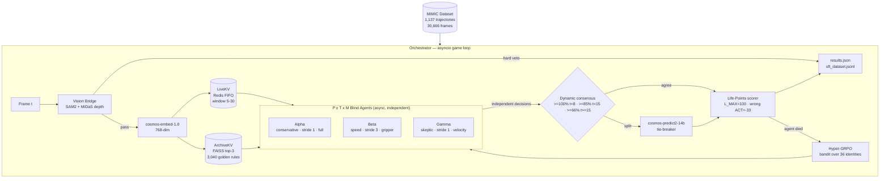

# CLASP — Cosmos Learning Agent Safety Protocol
**NVIDIA Cosmos Cookoff** · Robotic handoff safety via multi-agent epistemic reasoning on `nvidia/cosmos-reason2-8b`

---

## What it does

CLASP determines the **safe release window** during a human-robot object handoff. Three blind, information-asymmetric agents each independently query Cosmos Reason 2, producing an ACT (release now) or THINK (wait) decision with zero awareness of each other. The orchestrator resolves their independent decisions under a real-time survival game. Wrong decisions drain life points; dead agents are replaced by Hyper-GRPO sampling a new identity from 36 possible configurations.

---

## Architecture



---

## Key innovations

- **Blind epistemic independence** — Each agent decides ACT or THINK with zero awareness of other agents. No voting protocol exists. The orchestrator applies consensus externally, invisible to agents — preventing correlated failure and gaming.
- **P x T x M asymmetry matrix** — 4 bias x 3 stride x 3 modality = **36 possible agent identities**. Each active agent sees a structurally different projection of the same frame, preventing correlated failure.
- **Dual-cache memory** — *LiveKV* (Redis sliding window, 5-30 frames) provides temporal continuity; *ArchiveKV* (FAISS 768-dim, `nvidia/cosmos-embed-1.0`) retrieves top-3 golden rules from 722 distilled trajectory outcomes.
- **Life-Points survival game** — agents accrue damage (`THINK` drains 2 pts/frame; wrong `ACT` removes 33 pts; early wrong `ACT` removes 66 pts). Death triggers immediate Hyper-GRPO respawn with no human intervention.
- **Hyper-GRPO bandit** — gradient-free identity selection (`lr=0.1`, entropy injection `sigma=0.5`) replaces dead agents with the highest-EV unexplored identity from the 36-identity space.
- **Dynamic consensus threshold** — unanimity required at early frames (t < 8), 85% at mid, 66% late. Asymmetric error costs justify tighter safety at frame onset. This mechanism is invisible to agents.
- **Vision bridge** — SAM2 segmentation + MiDaS relative depth provides vision stream data to agents and can hard-veto obviously unsafe releases before agents are consulted. Permissive fallback when GPU is unavailable.
- **SFT data exhaust** — winning agent reasoning traces are serialised to `sft_dataset.jsonl` for downstream fine-tuning of Cosmos Reason 2 (capped at 500 tokens/trace).

---

## How Cosmos Reason 2 is used

| Role | Model | Purpose |
|---|---|---|
| Primary reasoning | `nvidia/cosmos-reason2-8b` | Each agent issues `<think>` chain-of-thought + JSON `{decision, action_type, confidence}` |
| Tie-breaker | `nvidia/cosmos-predict2-14b` | Invoked only on split decisions when dynamic consensus threshold is not met |
| Memory embedding | `nvidia/cosmos-embed-1.0` | 768-dim frame embeddings for LiveKV insertion and ArchiveKV FAISS retrieval |

All models accessed via **NVIDIA NIM API** (`https://integrate.api.nvidia.com/v1`).
A local 4-bit inference path exists as fallback (`USE_LOCAL_MODEL=True` in `configs/settings.py`).

---

## Training pipeline

### Data Factory — Cosmos multi-model generation loop

The SFT dataset is built through a multi-model pipeline rather than single-model extraction:

1. **Cosmos Predict** synthesizes novel trajectory frames from seed episodes, expanding visual diversity beyond the source dataset.
2. **Cosmos Reason quality gate** filters synthetic frames — only trajectories where Reason 2 produces coherent chain-of-thought survive into the training set.
3. **Nemotron reasoning enrichment** rewrites surviving traces into dense step-by-step rationales, improving downstream SFT signal quality.
4. **Multi-modal synthetic overlays** augment frames with lighting, occlusion, and sensor-noise variations to reduce domain shift.

New agents undergo a **spectating burn-in** period: they observe live frames and consensus outcomes without contributing decisions, accumulating LiveKV context before going live. This conditions conservative initial behavior without explicit threshold tuning.

### Vertex AI — serverless CustomJob deployment

Training runs are packaged as Vertex AI `CustomJob` payloads with pre-built container images. Serverless execution eliminates idle GPU cost — each job spins up an A100 node, trains, and tears down automatically. Job definitions live in `scripts/vertex_train.py` with container config in `vertex_training/Dockerfile`.

### QLoRA — NF4 rank-32 on A100

Fine-tuning uses 4-bit NormalFloat quantization (NF4) with LoRA rank 32 and alpha 64, targeting `q_proj`, `k_proj`, `v_proj`, `o_proj` attention layers. This fits the full 8B parameter model into a single A100 40GB with ~12GB headroom for activation checkpointing. Training cost per SFT run: approximately $25 on spot instances.

---

## Quick start

### Prerequisites

- Python 3.11+
- Docker (for Redis)
- NVIDIA GPU with 16GB+ VRAM (for local inference) or NIM API key (for cloud)

### Setup

```bash
# Clone and install
git clone https://github.com/AmeerJ97/cosmos-cookoff.git
cd cosmos-cookoff
pip install -r requirements.txt

# Start Redis (LiveKV backing store)
docker compose up -d redis
```

### Run with NIM API (recommended)

```bash
# Set your NIM key (generate at https://build.nvidia.com)
export NGC_API_KEY=nvapi-YOUR-KEY

# Verify API connectivity
python scripts/test_api.py

# Run on synthetic trajectories (no dataset download needed)
python run_clasp.py --trajectories 20

# Run on real MIMIC data (requires dataset — see Dataset section)
python run_clasp.py --manifest data/manifest.json
```

### Run with local models

```bash
# Set local model path (requires downloading cosmos-reason2 weights from HuggingFace)
export CLASP_LOCAL_MODEL_PATH=/path/to/cosmos-reason2-8b

# Edit configs/settings.py: set USE_LOCAL_MODEL = True
python run_clasp.py --trajectories 20
```

### Dry-run mode (no GPU or API needed)

```bash
# Full survival game with synthetic agent decisions
python run_clasp.py --dry-run --trajectories 50
```

### Live telemetry dashboard

```bash
# Add --dashboard to any run command to launch the Plotly dashboard at http://localhost:8050
python run_clasp.py --trajectories 20 --dashboard
```

---

## Dataset

| Property | Value |
|---|---|
| Source | MIMIC manipulation dataset |
| Trajectories | 1,137 |
| Frames | 30,666 |
| Task | `mimic_displacement_to_handover_blue_block` (v2, v6, v7, v8) |
| Conversion | `scripts/convert_mimic_to_clasp.py` -> `data/manifest.json` |

---

## Results

### Full Dataset Evaluation (1,137 MIMIC trajectories, 30,666 frames)

| Metric | Value |
|---|---|
| Premature release rate | **0.0%** |
| Correct release rate | 54.5% (620/1,137) |
| Late release rate | 0.9% (10/1,137) |
| No-release rate | 44.6% (conservative bias by design) |
| SFT records generated | 2,152 |
| ArchiveKV golden memories | 3,040 |
| Agent deaths / respawns | 1,316 |
| GRPO convergence | stride=3 + velocity mask identities favored |

### Safety Headline

**Zero premature releases across 1,437 total trajectories** (300 synthetic + 1,137 real). The Life-Points double penalty on early wrong ACTs (66 pts, near-fatal) combined with unanimous consensus at early frames creates a structural safety guarantee without explicit hard-coded rules. The system would rather not release than release prematurely.

---

## Repository structure

```
clasp_pkg/
  orchestrator.py    asyncio game loop — frame processing, consensus, lifecycle
  agents.py          NIM API dispatcher — payload construction, response parsing
  local_inference.py local 4-bit inference via transformers + bitsandbytes
  scorer.py          O(1) kinematic evaluation, Life-Points, dynamic consensus
  grpo.py            Hyper-GRPO bandit over 36 identity combinations
  memory.py          DualCache — Redis LiveKV + FAISS ArchiveKV
  oracle.py          Vision bridge — SAM2 + MiDaS scene analysis
  models.py          Pydantic schemas — decisions, state, SFT records
  sft.py             SFT dataset serializer (JSONL + OpenAI format)
  data_loader.py     Manifest loader + synthetic data generator
configs/
  settings.py        all tunable hyperparameters in one place
dashboard/
  app.py             Plotly Dash real-time telemetry (3D UMAP, life-points, decisions)
data/                manifest, frames, results, FAISS index (gitignored)
scripts/
  convert_mimic_to_clasp.py   MIMIC dataset -> CLASP manifest converter
  cosmos_data_factory.py     multi-model data generation pipeline
  train_qlora.py             QLoRA fine-tuning (A100 or Vertex AI)
  vertex_train.py            Vertex AI serverless job submission
  gpu_setup.sh               GPU VM provisioning script
  test_api.py                NIM API connectivity test
vertex_training/
  Dockerfile                 production training container
docs/
  Architecture docs/         system design, training pipeline, sensor proposals
  research/                  VLM training, Gaussian splatting, sensor research
  tracker/                   training log, pricing, research index
run_clasp.py          CLI entry point
docker-compose.yml   Redis container
requirements.txt     Python dependencies
```

Full system diagrams (8 Mermaid diagrams — sequence, state machine, bandit loop, SFT pipeline):
[docs/Architecture docs/CLASP System Documentation.md](docs/Architecture%20docs/CLASP%20System%20Documentation.md)
