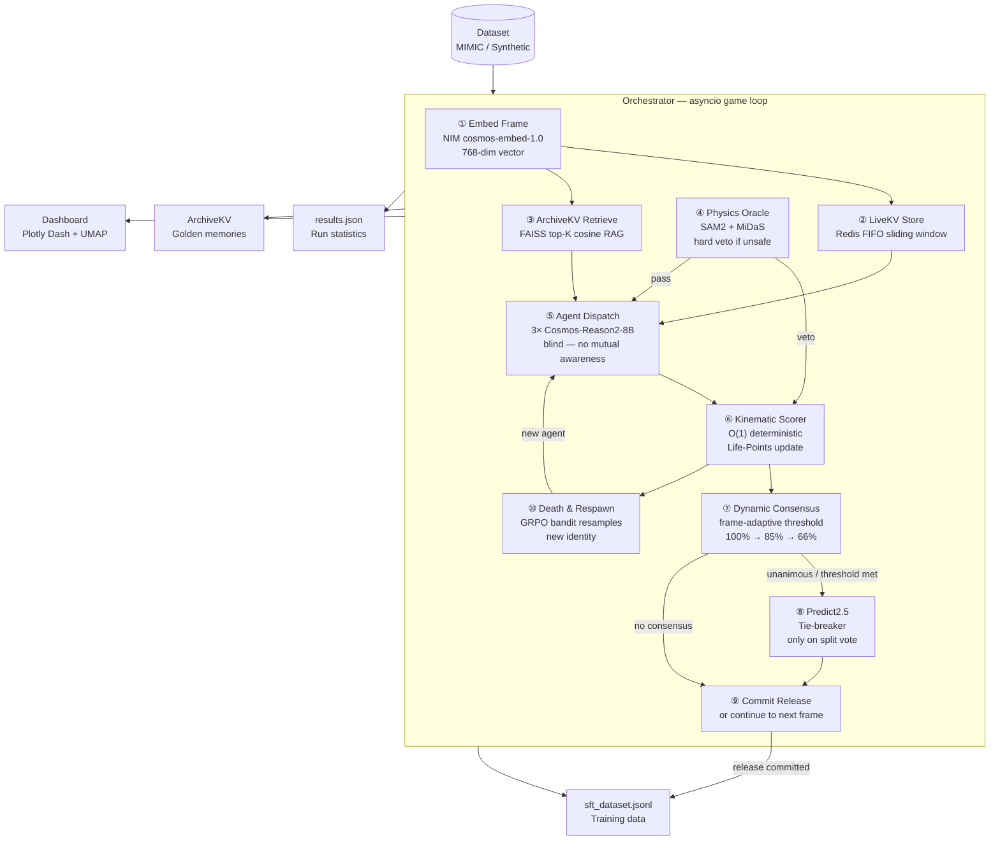
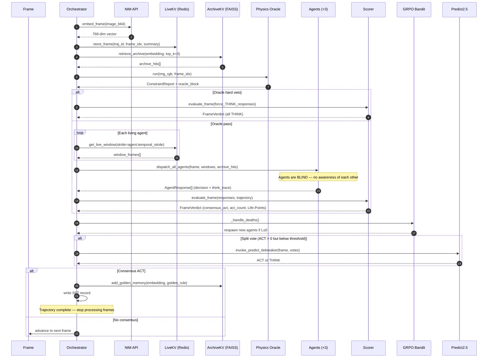
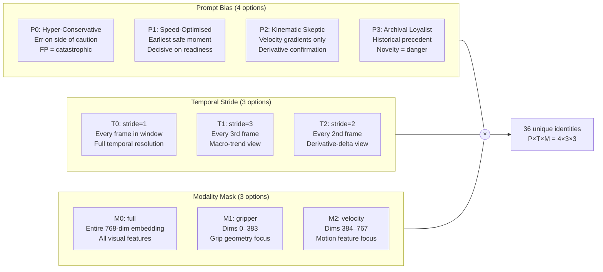
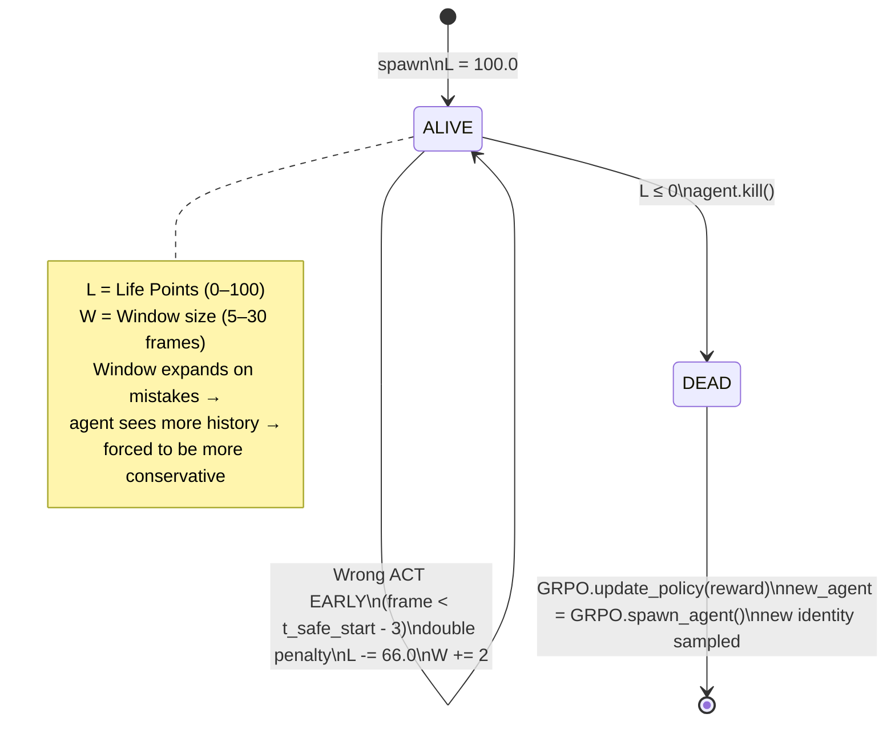

# ABEE — Complete System Documentation
### Adversarial Blind Epistemic Ensemble — NVIDIA Cosmos Cookoff 2026

> **Scope:** End-to-end technical reference with architecture diagrams, data flows, and algorithm specifications.

---

## Table of Contents

1. [What ABEE Does](#1-what-abee-does)
2. [Top-Level Architecture](#2-top-level-architecture)
3. [Per-Frame Processing Loop](#3-per-frame-processing-loop)
4. [Agent Identity Matrix (P×T×M)](#4-agent-identity-matrix-ptm)
5. [Life-Points Survival Game](#5-life-points-survival-game)
6. [Dual-Cache Memory System](#6-dual-cache-memory-system)
7. [Hyper-GRPO Identity Bandit](#7-hyper-grpo-identity-bandit)
8. [Physics Oracle](#8-physics-oracle)
9. [SFT Data Pipeline](#9-sft-data-pipeline)
10. [Configuration Reference](#10-configuration-reference)

---

## 1. What ABEE Does

ABEE answers one binary question per video frame:

> **Is it safe to release the object right now during a human-robot handoff?**

A real-time stream of RGB frames from a robot arm performing a handover is processed by an ensemble of 3 information-asymmetric VLM agents (Cosmos-Reason2-8B). Each agent independently emits either `ACT` (release now) or `THINK` (keep holding) — with zero awareness of the other agents. When the orchestrator's dynamic consensus threshold is met, the release window is committed.

The system is designed with three guarantees:
- **Never miss a safe window** (late release penalised via Life-Points)
- **Never release prematurely** (premature act is catastrophic: −33 to −66 pts)
- **Self-heal from bad agents** (survival game kills under-performers; GRPO respawns better ones)

---

## 2. Top-Level Architecture



---

## 3. Per-Frame Processing Loop

Each frame goes through exactly 11 ordered steps inside `Orchestrator.run_trajectory()`.



---

## 4. Agent Identity Matrix (P×T×M)

Every agent is assigned one of **36 unique identity combos** from the Cartesian product of three independent axes. Agents cannot see each other — information asymmetry is the core architectural guarantee.



**Default ensemble assignment:**

| Agent | Prompt Bias | Stride | Modality | Philosophy |
|-------|-------------|--------|----------|------------|
| Alpha | Hyper-Conservative | 1 | full | Maximally cautious, full context |
| Beta | Speed-Optimised | 3 | gripper | Fast decision, grip focus only |
| Gamma | Kinematic Skeptic | 1 | velocity | Derivative signals, no appearance trust |

---

## 5. Life-Points Survival Game



**Safe window definition:** A frame `t` is safe if `t_safe_start ≤ t ≤ t_safe_end`, where `t_safe_start = t_release - TAU_EARLY` (default 3) and `t_safe_end = t_release + TAU_LATE` (default 2).

**Dynamic consensus threshold** (invisible to agents):

| Frame index | Threshold fraction | Rationale |
|-------------|-------------------|-----------|
| `t < 8` | 100% (unanimous) | Too early — must be certain |
| `8 ≤ t < 15` | 85% | Mid frames — high confidence required |
| `t ≥ 15` | 66% | Late frames — majority sufficient |

---

## 6. Dual-Cache Memory System

```mermaid
flowchart TD
    subgraph LIVEKV["LiveKV — Redis (short-term)"]
        direction LR
        R1["frame_N-W ... frame_N\nFIFO sliding window\nkey: abee:live:{traj_id}"]
        R2["Per-agent stride slicing\nAlpha: every frame\nBeta: every 3rd\nGamma: every frame"]
        R1 --> R2
    end

    subgraph ARCHKV["ArchiveKV — FAISS (long-term)"]
        direction LR
        F1["FAISS IndexFlatIP\n768-dim vectors\ncosine similarity"]
        F2["Metadata: golden_rule\ntrajectory_id, frame_idx\nagent_name, timestamp"]
        F3["top_k=3 retrieval\nonly after burn_in=50 trajectories"]
        F1 --- F2
        F2 --> F3
    end

    FRAME["New Frame\n768-dim embedding"] -->|store| LIVEKV
    FRAME -->|query| ARCHKV

    LIVEKV -->|temporal window\nper agent stride| AGENT["Agent Prompt\ncontext injection"]
    ARCHKV -->|similar past handoffs\ngolden rules| AGENT

    CORRECT["Correct ACT\n(safe window)"] -->|distill think trace\nadd_golden_memory| ARCHKV

    ARCHKV -->|persist| DISK["archive_kv.index\n+ .meta.json"]
    DISK -->|reload| ARCHKV

    style LIVEKV fill:#1a3a1a,stroke:#3fb950
    style ARCHKV fill:#1a2a3a,stroke:#58a6ff
```



**Known limitation:** On FAISS index reload, `ArchiveMemory.embedding` is restored as `[]` (empty list) — the index itself is intact for retrieval, but code that accesses the embedding field directly post-reload hits zero vectors. Does not affect inference correctness.

---

## 7. Hyper-GRPO Identity Bandit

This is an **exponential-weight bandit** (EXP3 style) over the 36-identity action space. Model weights are **not** updated — this is an identity selection policy.

```mermaid
flowchart TD
    INIT["36-element logit vector\ninitialised to 0.0"]

    SOFT["Softmax → probability distribution\np_i = exp(logit_i) / Σ exp(logit_j)"]

    SAMP["Sample identity index\nfor spawned/new agent\n(weighted by p_i)"]

    UNPACK["Unpack identity:\nidentity_idx → P_bias + T_stride + M_mask\nfrom 4×3×3 grid"]

    RUN["Agent runs trajectory\naccumulating reward:\n+1 correct ACT\n-1 wrong ACT\n-0.1 per THINK frame"]

    DEATH["Agent death (L ≤ 0)\nor trajectory ends"]

    UPDATE["GRPO update:\nadvantage = reward - mean_reward_of_cohort\nlogit[identity_idx] += alpha * advantage\nalpha = 0.1"]

    ENTROPY["Entropy regularisation:\nif p_max > threshold:\n  add Gaussian noise σ=0.5\n  prevents collapse to single identity"]

    INIT --> SOFT --> SAMP --> UNPACK --> RUN --> DEATH --> UPDATE --> ENTROPY --> SOFT

    style INIT fill:#2a1a3a,stroke:#a371f7
    style UPDATE fill:#2a1a3a,stroke:#a371f7
    style ENTROPY fill:#1a2a1a,stroke:#3fb950
```



**Observed convergence (run 5 log):** Bandit converges toward `stride=1, mask=full` and `stride=2, mask=full` identities — consistent with the full-context advantage in detecting grip transfer timing.

---

## 8. Physics Oracle

```mermaid
flowchart TD
    IMG["RGB Frame\n(numpy array)"]

    subgraph SAM2["SAM2 — Segment Anything 2"]
        S1["Generate masks from image"]
        S2["Rank by stability score"]
        S3["Assign labels by rank:\n1st = gripper\n2nd = object\n3rd = hand\n(heuristic — not semantic)"]
        S1 --> S2 --> S3
    end

    subgraph MIDAS["MiDaS — Depth Estimation"]
        M1["DPT_Large forward pass"]
        M2["Depth map statistics:\nmean, std, min, max\nper masked region"]
        M1 --> M2
    end

    IMG --> SAM2
    IMG --> MIDAS

    SAM2 --> GEOM["Geometric analysis:\nmask overlap ratio\ngripper-object IOU\nhand proximity score"]
    MIDAS --> DEPTH["Depth block text:\ninjected into agent prompt\nnot used in veto logic"]

    GEOM --> VETO{"should_veto?\nphysics_score < 0.3\nor overlap < threshold"}

    VETO -->|yes| FORCE["Force all agents → THINK\nskip VLM dispatch entirely"]
    VETO -->|no| PASS["Proceed to agent dispatch\noracle_block injected into prompt"]

    FALLBACK["SAM2 checkpoint missing\n→ physics_score = 0.5\n→ no veto (graceful degradation)"]

    style FALLBACK fill:#3a1a1a,stroke:#f85149
    style VETO fill:#2a2a1a,stroke:#e3b341
```



---

## 9. SFT Data Pipeline

Every correct release generates a supervised fine-tuning record. This is the mechanism by which ABEE bootstraps training data from its own successful runs.

```mermaid
flowchart LR
    subgraph LIVE["Live Inference"]
        AG["Agent ACTs correctly\nin safe window"]
        TH["Think trace captured\n<think>...</think> + JSON"]
        GR["Golden rule distilled\n(keyword-filtered\nmax 450 chars)"]
        AG --> TH --> GR
    end

    subgraph RECORD["SFTRecord (Pydantic)"]
        F1["trajectory_id\nframe_idx\nagent_name"]
        F2["agent_bias (80 chars)\ntemporal_stride\nmodality_mask"]
        F3["decision: ACT\nconfidence: float\nthink_trace: str"]
        F4["is_correct: True\ngt_t_release: int\nembedding_snippet[0:16]\ngolden_rule: str"]
    end

    GR --> RECORD

    subgraph OUTPUT["sft_dataset.jsonl"]
        L1["One JSON line per record\nappend-only"]
        L2["to_openai_format():\nconverts to messages[]\n{role: system/user/assistant}"]
        L1 --> L2
    end

    RECORD --> OUTPUT

    subgraph TRAINING["Downstream Training"]
        T1["Cosmos-RL SFT\nnvidia/cosmos-reason2-8b\nCosmosAutoModel"]
        T2["GRPO fine-tuning\ngroup rewards\nKL-constrained policy update"]
        T3["Distilled student\nvia teacher-student\non real MIMIC frames"]
        T1 --> T2
        T1 --> T3
    end

    OUTPUT --> TRAINING

    style OUTPUT fill:#1a2a1a,stroke:#3fb950
    style TRAINING fill:#1a1a3a,stroke:#58a6ff
```



---

## 10. Configuration Reference

All tunable parameters live in `configs/settings.py`. No values are scattered across source files.

| Parameter | Default | Effect |
|-----------|---------|--------|
| `L_MAX` | 100.0 | Starting life points per agent |
| `GAMMA_THINK` | 2.0 | Life drain per THINK frame |
| `GAMMA_WRONG` | 33.0 | Penalty per wrong ACT |
| `TAU_EARLY_BONUS` | 3 | Frames before `t_safe_start` that trigger 2× penalty |
| `DELTA_W` | 2 | Window expansion step per mistake |
| `WINDOW_MIN` | 5 | Minimum LiveKV frame window |
| `WINDOW_MAX` | 30 | Maximum LiveKV frame window |
| `T_MIN_UNANIMOUS` | 8 | Frames below which unanimous consensus required |
| `T_MID_RELAXED` | 15 | Frames above which 66% consensus sufficient |
| `GRPO_LEARNING_RATE` | 0.1 | Bandit logit update step size |
| `GRPO_ENTROPY_SIGMA` | 0.5 | Noise injected when distribution collapses |
| `FAISS_DIM` | 768 | Embedding dimensionality |
| `FAISS_TOP_K` | 3 | Archive memories retrieved per frame |
| `BURN_IN_THRESHOLD` | 50 | Trajectories before RAG retrieval activates |
| `TAU_EARLY` | 3 | Frames before `t_release` still counted as safe |
| `TAU_LATE` | 2 | Frames after `t_release` still counted as safe |
| `USE_LOCAL_MODEL` | False | Local 4-bit Cosmos vs NIM API |
| `ABEE_LOCAL_MODEL_PATH` | `models/cosmos-reason2-8b` | Override via env var |

---

## Quick Start (reproduced for reference)

```bash
# 1. Dependencies
pip install -r requirements.txt

# 2. Redis (required for LiveKV)
docker compose up -d redis

# 3. NIM API key (optional — dry-run works without)
export NGC_API_KEY=nvapi-YOUR-KEY

# 4. Dry run — no API calls, synthetic data, instant results
python run_abee.py --dry-run --trajectories 20

# 5. Full run with live telemetry at http://localhost:8050
python run_abee.py --trajectories 50 --dashboard

# 6. Local model instead of NIM (set env var for model path)
export ABEE_LOCAL_MODEL_PATH=/path/to/cosmos-reason2-8b
python run_abee.py --trajectories 50
```

**Dry-run results (6 runs, 60+ trajectories):**
- Correct releases: **100%**
- Premature releases: **0%**
- ArchiveKV growth: 0 → 713 golden memories
