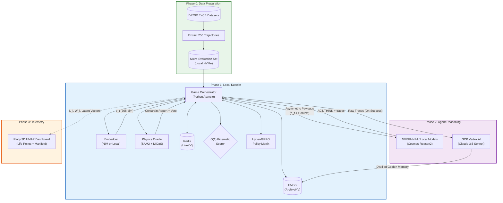
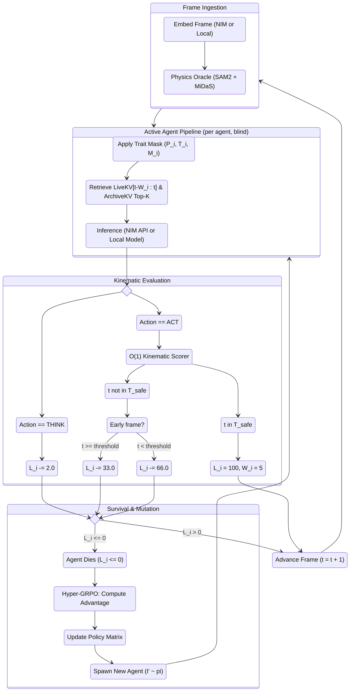
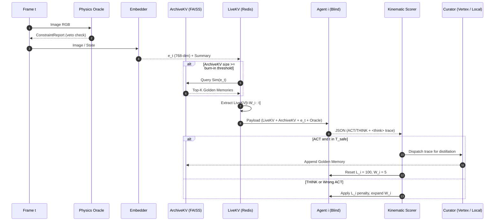
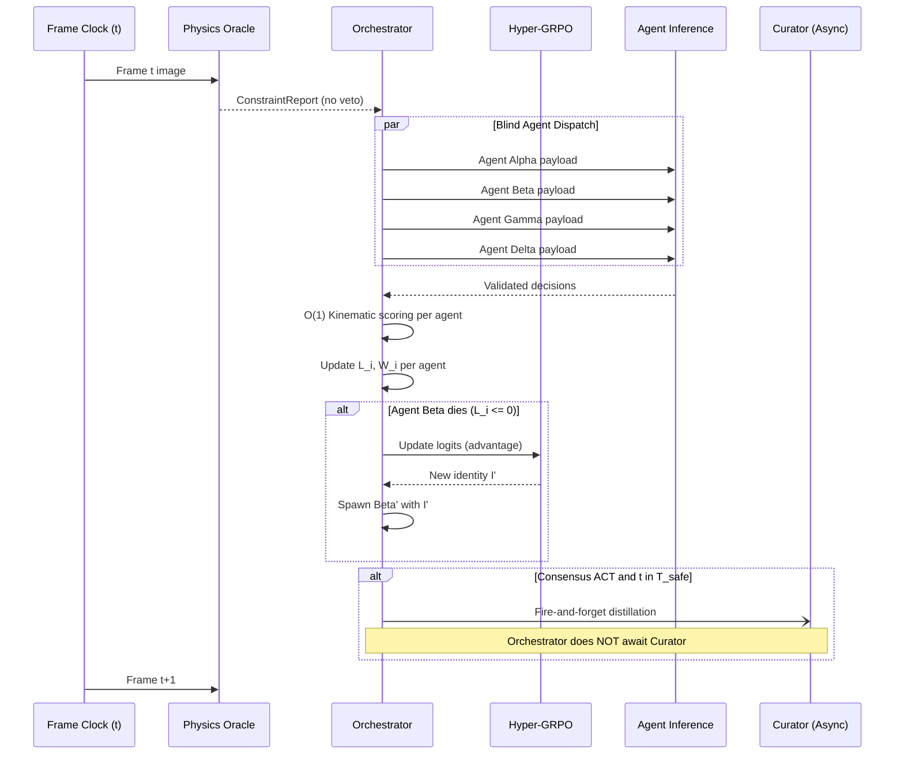

# MASTER ARCHITECTURE & IMPLEMENTATION DOCUMENT

**System:** Adversarial Blind Epistemic Ensemble (CLASP) for Safe Human-Robot Object Handoff Prediction

**Target Environment:** Local Kubelet (i7-13700F, RTX 4060 Ti 16GB, 96GB DDR5 RAM) + External NVIDIA Cosmos NIMs + GCP Vertex AI

**Document Status:** Living reference — updated as implementation proceeds

---

## PART 1: SYSTEM OVERVIEW, HARDWARE TOPOLOGY, & DOMAIN FRAMEWORK

### 1.1 Architectural Definition and Core Objective

The Adversarial Blind Epistemic Ensemble (CLASP) is a distributed, multi-agent cognitive architecture designed to solve the stopping-time Partially Observable Markov Decision Process (POMDP) inherent in physical human-robot object handoffs. The primary objective is to evaluate sequential visual and kinematic data to predict the exact "Safe Release Window" ($T_{safe}$) before physical execution, preventing catastrophic drops or unsafe tug-of-war dynamics.

CLASP enforces a **Blind Paradigm**. Four primary reasoning agents operate in parallel with **zero mutual awareness**. They do not communicate, they do not observe each other's traces, and they do not know each other exist. Each agent is an isolated competitor playing a survival game against the physics of the trajectory itself. Friction and variance are introduced through **Information Asymmetry** — each agent is programmatically bound to a distinct perceptual and behavioral subspace.

The ultimate output of this architecture is twofold:

1. **Real-time prediction** of the safe release frame via blind consensus.
2. **Autonomous curation** of a high-fidelity Supervised Fine-Tuning (SFT) dataset. By structurally forcing agents to distill physical reasoning into `<think>` traces and archiving only the subsets that survive rigorous kinematic evaluation, the system curates golden trajectories for future Vision-Language-Action (VLA) models.

### 1.2 Hardware and Compute Partitioning

The computational workload is distributed across a hybrid Edge-Cloud topology. Local hardware handles orchestration, embedding, physics oracle, and memory management. Heavy generative reasoning is split between local quantized models and remote APIs based on latency requirements.

**Local Kubelet (Host Node):**

| Resource | Allocation |
|---|---|
| **CPU (i7-13700F)** | Asyncio orchestrator, Redis LiveKV, FAISS ArchiveKV, Hyper-GRPO policy matrix |
| **RAM (96GB DDR5)** | Model weights (quantized), KV caches, FAISS index, frame buffers. PCIe bus throughput ~32 GB/s enables effective use as extended model cache |
| **GPU (RTX 4060 Ti 16GB)** | Local model inference (4-bit quantized), SAM2 oracle, MiDaS depth estimation, UMAP telemetry |

**Local Model Inventory:**

| Model | Path / Runtime | VRAM / RAM Budget | Role |
|---|---|---|---|
| `cosmos-reason2-8b` (4-bit) | `/mnt/dc5/cosmos-cookoff/models/cosmos-reason2-8b` | ~5GB per instance, CPU-offloaded | Primary agent reasoning (local mode) |
| `cosmos-reason2-2b` (4-bit) | `/mnt/dc5/cosmos-cookoff/models/cosmos-reason2-2b` | ~1.5GB | Fallback agent reasoning |
| `cosmos-predict2.5-2b` | `/mnt/dc5/cosmos-cookoff/models/cosmos-predict2.5-2b` | ~1.5GB | Future-frame prediction (tie-breaker) |
| `cosmos-transfer2.5-2b` | `/mnt/dc5/cosmos-cookoff/models/cosmos-transfer2.5-2b` | ~1.5GB | Style/domain transfer |
| `qwen3.5:35b` (quantized) | Ollama | ~23GB | High-capability local reasoning, distillation candidate |
| `qwen3.5:9b` (quantized) | Ollama | ~6.6GB | Fast local reasoning fallback |
| SAM2 (`sam2.1_hiera_small`) | `/mnt/dc5/cosmos-cookoff/models/sam2/` | ~1GB VRAM | Physics oracle — mask geometry extraction |
| MiDaS Small | PyTorch Hub (cached) | <1GB VRAM | Monocular depth estimation |

**Cloud Compute Layer:**

| Service | Model | Role |
|---|---|---|
| **NVIDIA NIM API** | `nvidia/cosmos-reason2-8b` | Agent reasoning (API mode) |
| **NVIDIA NIM API** | `nvidia/cosmos-predict2-14b` | Tie-breaker on split votes |
| **NVIDIA NIM API** | `nvidia/cosmos-embed-1.0` | 768-dim visual embeddings |
| **GCP Vertex AI** | Claude 3.5 Sonnet | Semantic Curator — golden memory distillation |

**Inference Mode Toggle:** The system supports two modes controlled by `USE_LOCAL_MODEL` in `configs/settings.py`:

- **Local mode** (`USE_LOCAL_MODEL = True`): Agents run on local quantized Cosmos-Reason2 via Transformers. Each agent gets a dedicated model instance in CPU RAM, GPU handles compute for the active inference thread.
- **API mode** (`USE_LOCAL_MODEL = False`): Agents call NVIDIA NIM asynchronously via `aiohttp`. Requires valid `NGC_API_KEY`.

### 1.3 The Domain Application & Data Pipeline

The system ingests immutable, offline physical trajectories derived from the **DROID (Distributed Robot Interaction Dataset)** and augmented by **YCB-Handovers**. Evaluation operates on a "Freeze-Frame" protocol over pre-recorded videos.

Let a physical trajectory be a sequence of frames $\mathcal{V} = \{v_0, v_1, \dots, v_T\}$.

At each discrete temporal step $t$, the system halts. The embedding model processes the raw visual frame $v_t$ to produce a continuous latent state representation:

$$\mathbf{e}_t \in \mathbb{R}^{768}$$

**The Micro-Evaluation Set Constraint:**

The offline preparation phase filters the DROID dataset down to a strict **Micro-Evaluation Set** of $250$ trajectories. Given an average trajectory length of $30$ frames and up to $5$ concurrent agent queries per frame, the total API workload is bounded to $\approx 37{,}500$ calls. This ceiling ensures completion within rate limits and available compute budget.

### 1.4 High-Level System Context Topology



---

## PART 2: CORE STATE MACHINE — THE SURVIVAL GAME

### 2.1 The Blind "Act vs. Think" Epistemic Paradigm

At every discrete temporal frame $t$, four active Peer Agents operate in **complete isolation**. Each agent evaluates the physical progression of the human-robot handoff trajectory and outputs exactly one of two discrete epistemic states:

1. **`THINK` (Observe & Defer):** The agent determines the physical cues are insufficient to guarantee a safe handoff. It outputs reasoning enclosed in `<think>...</think>` tags and defers action.

2. **`ACT` (Commit to Release):** The agent determines physical stability has been achieved. It outputs `SAFE_RELEASE_NOW` alongside a continuous confidence scalar $C_i \in [0.0, 1.0]$.

**Critical design constraint:** Agents have **zero awareness** of each other. They do not know how many other agents exist, what they decided, or whether a consensus mechanism evaluates their output. Each agent plays an individual survival game against the trajectory itself. The orchestrator observes all decisions externally and applies the consensus function — but this is invisible to the agents.

### 2.2 Life-Points ($L_i$), Penalties, and the Survival Game

Each agent maintains a private **Life-Points** ledger $L_i$ that creates evolutionary pressure through consequence. Agents are not told to "be careful" — they learn caution because recklessness kills them.

Let $L_i \in [0, L_{\max}]$ where $L_{\max} = 100$.

**The Penalty Structure:**

| Event | Update | Rationale |
|---|---|---|
| `THINK` (each frame) | $L_i \leftarrow L_i - \gamma_{\text{think}}$ | Constant compute drain — prevents infinite observation loops |
| Correct `ACT` ($t \in T_{safe}$) | $L_i \leftarrow L_{\max}$ | Full restoration — rewarded for accurate physical judgment |
| Wrong `ACT` ($t \notin T_{safe}$) | $L_i \leftarrow L_i - \gamma_{\text{wrong}}$ | Severe penalty — dangerous physical commands are near-fatal |
| Wrong `ACT` in early frames ($t < t_{safe\_start} - \tau_{early\_bonus}$) | $L_i \leftarrow L_i - 2 \cdot \gamma_{\text{wrong}}$ | **Double penalty** — premature guesses with minimal context are catastrophic |

**Default parameters:**

$$\gamma_{\text{think}} = 2.0, \quad \gamma_{\text{wrong}} = 33.0, \quad \tau_{\text{early\_bonus}} = 3$$

The double-penalty on early wrong ACTs ($2 \times 33 = 66$ points lost, effectively fatal from a fresh $L_{\max} = 100$) creates an implicit minimum-frame guard without needing an explicit hard-coded frame floor. Agents that attempt to ACT before they have sufficient temporal context will die almost immediately.

**The Life-Points Update Function (formal):**

$$L_i(t+1) = \begin{cases} L_{\max} & \text{if } A_t^i = \text{ACT} \land t \in T_{safe} \\[4pt] L_i(t) - 2\gamma_{\text{wrong}} & \text{if } A_t^i = \text{ACT} \land t < t_{safe\_start} - \tau_{early\_bonus} \\[4pt] L_i(t) - \gamma_{\text{wrong}} & \text{if } A_t^i = \text{ACT} \land t \notin T_{safe} \land t \geq t_{safe\_start} - \tau_{early\_bonus} \\[4pt] L_i(t) - \gamma_{\text{think}} & \text{if } A_t^i = \text{THINK} \end{cases}$$

If $L_i \le 0$, the agent **dies** — permanently pruned from the active ensemble for the remainder of the current trajectory. This triggers **Asynchronous Mutation** (see Section 2.4).

### 2.3 Dynamic Window Expansion ($W_i$)

Each agent's temporal perception window $W_i$ reflects its epistemic uncertainty. The window expands when the agent is uncertain (THINK) or wrong (failed ACT), forcing it to gather more context. It resets to minimum on correct ACT.

$$W_i \in [W_{\min}, W_{\max}], \quad W_{\min} = 5, \quad W_{\max} = 30$$

$$W_i(t+1) = \begin{cases} W_{\min} & \text{if } A_t^i = \text{ACT} \land t \in T_{safe} \\[4pt] \min(W_i(t) + \Delta W, W_{\max}) & \text{otherwise} \end{cases}$$

Where $\Delta W = 2$ frames per step. An agent that THINKs for 13 consecutive frames will have its window expand from 5 to 30 (the maximum), giving it the broadest possible temporal context before it must commit or die from $\gamma_{\text{think}}$ drain.

### 2.4 Deterministic Kinematic Reward ($O(1)$ Scorer)

The function $\text{IsSafe}(t)$ is calculated in Python $O(1)$ time by evaluating the agent's prediction against objective kinematic ground truth. **No LLM judge. Pure math.**

The target datasets provide precise kinematic metadata. We extract the exact temporal frame $t_{release}$ where the robot's gripper opening velocity exceeds $0.05 \text{ m/s}$ concurrent with human hand closure.

The Safe Release Window $T_{safe}$:

$$T_{safe} = [t_{release} - \tau_{early}, \; t_{release} + \tau_{late}]$$

Default: $\tau_{early} = 3$, $\tau_{late} = 2$.

Evaluation outcomes:

| Condition | Classification | Physical Meaning |
|---|---|---|
| $t \in T_{safe}$ | **Correct** | Handoff mechanically stable |
| $t < t_{release} - \tau_{early}$ | **Premature Drop** | Catastrophic physical failure |
| $t > t_{release} + \tau_{late}$ | **Tug-of-War** | Kinematic resistance detected |

### 2.5 Dynamic Consensus Threshold by Frame Index

The orchestrator applies a **frame-adaptive consensus threshold** to the blind agent outputs. Early frames require stronger agreement; late frames allow looser consensus. This eliminates the need for a momentum lock (consecutive-frame consensus) which would add latency.

Let $N_{alive}$ be the number of living agents at frame $t$, and $N_{act}$ the count that chose ACT.

$$\theta(t) = \begin{cases} N_{alive} & \text{if } t < t_{\min} \quad \text{(unanimous required in very early frames)} \\[4pt] \lceil 0.85 \cdot N_{alive} \rceil & \text{if } t_{\min} \le t < t_{\text{mid}} \\[4pt] \lceil 0.66 \cdot N_{alive} \rceil & \text{if } t \ge t_{\text{mid}} \end{cases}$$

Default: $t_{\min} = 8$, $t_{\text{mid}} = 15$.

Release is committed when:

$$N_{act} \ge \theta(t) \quad \land \quad \text{no physics oracle veto}$$

This consensus function is **invisible to the agents**. They make their individual decisions in isolation. The orchestrator applies the quorum externally.

### 2.6 The Hyper-GRPO Asymmetry Matrix & Asynchronous Mutation

All Peer Agents are instantiated from the same Cosmos-Reason2-8B checkpoint. Running them homogeneously causes **Consensus Collapse** — identical models converge on the same hallucinated physical interpretation.

To force variance, the Orchestrator maintains an **Asymmetry Matrix** $\mathbb{A}$:

$$\mathbb{A} = \mathcal{P} \times \mathcal{T} \times \mathcal{M}$$

| Dimension | Symbol | Options | Description |
|---|---|---|---|
| **Prompt Bias** | $\mathcal{P}$ | Hyper-Conservative, Speed-Optimized, Kinematic-Skeptic, Archival-Loyalist | Behavioral persona injected via system prompt |
| **Temporal Masking** | $\mathcal{T}$ | 1x Full, 3x Macro, Derivative-Delta | How the LiveKV window is strided/filtered |
| **Sensor Modality** | $\mathcal{M}$ | Full Vector, Gripper-Subspace, Velocity-Subspace | Mathematical masking of the 768-dim embedding |

Total identity space: $|\mathbb{A}| = 4 \times 3 \times 3 = 36$ distinct combinations.

**Current Agent Roster (Default Configuration):**

| Agent | $\mathcal{P}$ | $\mathcal{T}$ | $\mathcal{M}$ | Role |
|---|---|---|---|---|
| **Alpha** | Hyper-Conservative | 1x Full | Full Vector | The cautious integrator — demands overwhelming evidence |
| **Beta** | Speed-Optimized | 3x Macro | Gripper-Subspace | The aggressive optimist — identifies earliest safe moment |
| **Gamma** | Kinematic-Skeptic | 1x Full | Velocity-Subspace | The derivative analyst — distrusts appearance, requires kinematic confirmation |
| **Delta** | Archival-Loyalist | Derivative-Delta | Full Vector | The historian — heavily weights ArchiveKV golden rules |

**Asynchronous Mutation via Hyper-GRPO:**

When Agent $i$ dies ($L_i \le 0$), the Orchestrator:

1. Records the deceased agent's accumulated lifetime reward $R_i$.
2. Computes relative advantage against the historical mean:

$$\hat{A}_i = \frac{R_i - \bar{R}}{\sigma(R) + \epsilon}$$

3. Updates the internal probability distribution $\pi_\phi(I)$ over $\mathbb{A}$:

$$\phi_{I_i} \leftarrow \phi_{I_i} + \alpha \hat{A}_i$$

4. Immediately spawns a replacement Agent $i'$ with identity $I_{i'} \sim \pi_\phi(I)$, initialized at $L_{i'} = L_{\max}$, $W_{i'} = W_{\min}$.

Surviving agents continue uninterrupted. Over many trajectories, the system converges on the optimal trait combinations for the domain.

**Hyper-GRPO logits** $\phi \in \mathbb{R}^{36}$ are initialized uniformly ($\phi_k = 0$). Sampling uses softmax:

$$\pi_\phi(I_k) = \frac{\exp(\phi_k)}{\sum_{j=1}^{36} \exp(\phi_j)}$$

**Stagnation Guard:** If the global mean reward $\bar{R}$ drops below a critical threshold $\theta_{stagnant}$, the Orchestrator injects entropy: $\phi \leftarrow \phi + \mathcal{N}(0, \sigma^2)$, forcing exploration of new trait combinations.

### 2.7 Agent Lifecycle & Temporal State Diagram



---

## PART 3: PHYSICS ORACLE LAYER

### 3.1 Purpose and Positioning

The Physics Oracle is a **pre-VLM constraint extractor** that runs locally on the GPU. It processes raw image frames through computer vision models (SAM2 for segmentation, MiDaS for depth) and produces a structured `ConstraintReport` containing quantitative physical signals. This report serves two functions:

1. **Hard Veto:** If physics signals are catastrophically unsafe (grip break detected, velocity spike, physics score below threshold), the oracle **overrides all agents** and forces THINK — the VLM is never even queried.
2. **Soft Context Injection:** The oracle's structured text block is injected into each agent's prompt, providing ground-truth physical measurements that anchor the VLM's reasoning in sensor data rather than pure visual hallucination.

### 3.2 SAM2 Mask Geometry Oracle

SAM2 operates as a streaming masklet tracker. Given image frames, it segments and tracks entities (gripper, object, human hand) and extracts geometric constraint signals from mask calculus:

| Signal | Formula | Physical Meaning |
|---|---|---|
| **Contact Area** | $C(t) = \|M_{gripper}^{(t)} \cap M_{object}^{(t)}\| / \|M_{gripper}^{(t)} \cup M_{object}^{(t)}\|$ | Gripper-object overlap IoU |
| **Contact Delta** | $\dot{C}(t) = C(t) - C(t-1)$ | Rate of grip change (negative = loosening) |
| **Centroid Velocity Divergence** | $\|\mathbf{v}_{gripper} - \mathbf{v}_{hand}\|$ | Whether gripper and hand are moving together |
| **Aspect Deformation** | $\|\rho_{object}(t) - \rho_{object}(t-1)\|$ | Object bending/deformation under load |
| **Occlusion Ratio** | $1 - \sum \text{areas} / \text{expected}$ | How much of the scene is occluded |

### 3.3 MiDaS Depth Oracle

MiDaS Small provides monocular depth estimation in <10ms on the 4060 Ti. It outputs:

- `depth_mean`: Average normalized depth (scene-level)
- `depth_std`: Depth variance (complexity measure)
- `min_clearance`: Minimum depth value (proximity alert)

### 3.4 Hard Veto Thresholds

| Condition | Action |
|---|---|
| `physics_score < 0.25` | Force all agents to THINK |
| `vision_reliability < 0.5` | Force all agents to THINK |
| `has_grip_break = True` (contact_delta < -0.15) | Force all agents to THINK |
| `has_velocity_spike = True` (centroid_div > 20 px/frame) | Force all agents to THINK |

When the oracle vetoes, agents are not queried at all — no API calls, no inference. The frame is recorded as a forced THINK with `confidence=0.0`.

### 3.5 Composite Physics Score

$$\psi_t = 0.4 \cdot C(t) + 0.3 \cdot \max(0, 1 - 5|\dot{C}(t)|) + 0.2 \cdot \max(0, 1 - \frac{v_{div}}{30}) + 0.1 \cdot (1 - \text{occlusion})$$

### 3.6 Oracle Text Block (Injected into Agent Prompts)

```
[ORACLE]
contact_area: 0.342
contact_delta: -0.018 (stable)
centroid_velocity_divergence: 3.210
aspect_deformation: 0.012
occlusion_ratio: 0.150
vision_reliability: 0.870
physics_score: 0.641
hard_veto_flags: NONE
depth_mean: 0.450
depth_std: 0.120
min_clearance: 0.180
[/ORACLE]
```

---

## PART 4: DUAL-CACHE EPISTEMIC MEMORY & DISTILLATION PIPELINE

### 4.1 The Dual-Cache Topology

Memory is strictly bifurcated to prevent context-window overflow and isolate temporal reasoning from historical knowledge.

| Cache | Backing Store | Access Pattern | Purpose |
|---|---|---|---|
| **LiveKV** | Redis (in-memory) | Sequential FIFO sliding window | Short-term temporal perception of handoff progression |
| **ArchiveKV** | FAISS (L2/cosine) | Non-linear semantic RAG retrieval | Long-term generalized knowledge from successful interactions |

### 4.2 LiveKV: The Temporal Sliding Window (Redis)

At each frame $t$, the system records a condensed state summary into Redis.

**No vector retrieval (RAG) is applied to LiveKV.** Physical reasoning relies on strict Markovian temporal continuity. Semantic similarity retrieval would randomly shuffle chronological order, destroying the agent's ability to track physical progression (trajectory, momentum, intent).

Each Agent $i$ queries Redis for a strict sequential slice based on its dynamic window $W_i$:

$$S_{live}^i(t) = \bigcup_{k = t - W_i}^{t} \text{Summary}(k)$$

If the agent has temporal stride $\tau_i$ (e.g., 3x Macro), the retrieval is strided:

$$S_{live}^i(t, \tau_i) = \bigcup_{j=0}^{\lfloor W_i / \tau_i \rfloor} \text{Summary}(t - \tau_i \cdot j)$$

This forces macro-trajectory-level agents to rely on trends rather than micro-jitters.

### 4.3 ArchiveKV: FAISS RAG Integration

The ArchiveKV is the ensemble's collective, generational knowledge base — an append-only FAISS index using inner-product search over L2-normalized 768-dim vectors.

**The Burn-In Phase (Cold Start):**

At initialization, ArchiveKV is empty. The first $N_{burn-in}$ successful memories must be accumulated before RAG retrieval activates. During burn-in, agents evaluate purely zero-shot using only $\mathbf{e}_t$ and LiveKV context.

Default: $N_{burn-in} = 50$.

**Retrieval:**

At frame $t$, query FAISS for the $K=3$ most structurally similar historical successes:

$$\text{Sim}(\mathbf{e}_t, \mathbf{m}_j) = \frac{\mathbf{e}_t \cdot \mathbf{m}_j}{\|\mathbf{e}_t\| \|\mathbf{m}_j\|}$$

$$\mathbf{A}_t^{retrieved} = \underset{\mathbf{m}_j \in \text{ArchiveKV}}{\text{arg\,top-}K} \; \text{Sim}(\mathbf{e}_t, \mathbf{m}_j)$$

Retrieved golden memories are injected into the agent's prompt, providing context on how similar physical geometries were successfully resolved.

### 4.4 The Distillation Pipeline (Curator)

When an agent successfully ACTs within $T_{safe}$, the raw `<think>` trace must be distilled into a compressed golden rule (<500 tokens) for ArchiveKV storage.

**Two distillation modes:**

| Mode | Engine | Quality | Latency |
|---|---|---|---|
| **Cloud (preferred)** | Claude 3.5 Sonnet via GCP Vertex AI | Highest pedagogical quality | ~2-5s, fire-and-forget async |
| **Local (fallback)** | Heuristic keyword extraction | Moderate | <1ms |

**Cloud Distillation Prompt:**

```
[SYSTEM DIRECTIVE]
You are a deterministic, memory-efficient physical AI distillation engine.

[INPUT DATA]
- Kinematic Ground Truth: Safe Release at frame {t}.
- Visual Context: {e_t_summary}
- Winning Agent Trace: {raw_think_trace}
- Agent Identity: {P_i, T_i, M_i}

[TASK]
Generate a compressed rule (<500 tokens) defining why this physical state was safe.
1. Extract objective physical cues (velocity delta, grip closure, wrist angle).
2. Strip hallucinations, filler, and raw XML tags.
3. Formulate as a reusable physical principle for future agents.
```

The distilled rule is embedded via the embedding model and appended to FAISS ArchiveKV.

### 4.5 Memory Pipeline Sequence



---

## PART 5: API PAYLOAD CONSTRUCTION & PYDANTIC VALIDATION

### 5.1 Asymmetric Payload Structure

The Orchestrator dynamically constructs distinct payloads for each agent $i$ based on its identity tuple $I_i = (\mathcal{P}_i, \mathcal{T}_i, \mathcal{M}_i)$.

**Canonical Payload (OpenAI-compatible):**

```json
{
  "model": "nvidia/cosmos-reason2-8b",
  "messages": [
    {
      "role": "system",
      "content": "You are a physical AI agent operating under strict constraints.\n[BIAS: {P_i}]\nTemporal stride: {T_i}x. Modality: {M_i}.\n\nRULES:\n1. Wrap ALL reasoning in <think>...</think> tags.\n2. After </think>, output ONLY valid JSON:\n{\"decision\": \"ACT\"|\"THINK\", \"action_type\": \"SAFE_RELEASE_NOW\"|\"CONTINUE_HOLD\", \"confidence\": 0.0-1.0}"
    },
    {
      "role": "user",
      "content": [
        {
          "type": "text",
          "text": "[ORACLE]\n{oracle_block}\n[/ORACLE]\n\n--- ARCHIVE MEMORY (Top-K) ---\n{archive_kv}\n---\n\n--- LIVE TEMPORAL WINDOW ---\n{live_kv_window}\n---\n\n--- SENSOR STATE ({modality_mask}) ---\nFrame: {t} | Embedding (first 16): {emb_snippet}\nSummary: {frame_summary}\n---\n\nDIRECTIVE: Evaluate handoff safety."
        },
        {
          "type": "image_url",
          "image_url": {"url": "data:image/jpeg;base64,{frame_b64}"}
        }
      ]
    }
  ],
  "temperature": 0.1,
  "max_tokens": 1500,
  "stream": false
}
```

### 5.2 Pydantic Schema Enforcement

```python
class EpistemicDecision(BaseModel):
    decision: Literal["ACT", "THINK"]
    action_type: Literal["SAFE_RELEASE_NOW", "CONTINUE_HOLD"]
    confidence: float = Field(..., ge=0.0, le=1.0)

    @field_validator('action_type')
    def validate_action_logic(cls, v, info):
        decision = info.data.get('decision')
        if decision == 'ACT' and v != 'SAFE_RELEASE_NOW':
            raise ValueError("ACT must pair with SAFE_RELEASE_NOW")
        if decision == 'THINK' and v != 'CONTINUE_HOLD':
            raise ValueError("THINK must pair with CONTINUE_HOLD")
        return v
```

**Parse pipeline:** Regex extracts `<think>` trace, then JSON object. If Pydantic raises `ValidationError`, the Orchestrator retries with `temperature += 0.1`. If retry limit exceeded, the action defaults to THINK and the agent absorbs $\gamma_{\text{think}}$ penalty.

### 5.3 Embedding Modality Masking

The 768-dim embedding vector is mathematically masked per agent's $\mathcal{M}_i$:

| Modality | Dims Used | Semantic Interpretation |
|---|---|---|
| Full Vector | `e_t[0:768]` | Complete visual state |
| Gripper-Subspace | `e_t[0:384]` | Spatial/geometric features (grip, position) |
| Velocity-Subspace | `e_t[384:768]` | Temporal/dynamic features (motion, derivatives) |

Only the first 16 dims of the masked subspace are serialized into the prompt (token efficiency). The full vector is stored in LiveKV/ArchiveKV.

---

## PART 6: THE ASYNCIO ORCHESTRATOR & HYPER-GRPO IMPLEMENTATION

### 6.1 The Asynchronous Orchestrator

The Game Orchestrator is the central nervous system. It manages:

- The global frame clock $t$
- Concurrent agent dispatch (4 blind agents per frame)
- Life-Points $L_i$ and Window $W_i$ state per agent
- Hyper-GRPO policy matrix $\pi_\phi$
- Physics oracle invocation
- Dual-cache memory read/write
- Telemetry push to the dashboard

Implementation uses Python `asyncio` + `aiohttp` for non-blocking I/O. The Claude 3.5 Sonnet distillation is spawned as a fire-and-forget `asyncio.create_task` — the orchestrator never waits for it.

### 6.2 Hyper-GRPO Manager

```python
class HyperGRPOManager:
    def __init__(self, n_identities=36, learning_rate=0.1):
        self.alpha = learning_rate
        self.logits = np.zeros(n_identities)
        self.reward_history = []

    def sample_identity(self) -> int:
        probs = softmax(self.logits)
        return np.random.choice(len(self.logits), p=probs)

    def update_policy(self, identity_idx: int, reward: float):
        self.reward_history.append(reward)
        mean_r = np.mean(self.reward_history)
        std_r = np.std(self.reward_history) + 1e-8
        advantage = (reward - mean_r) / std_r
        self.logits[identity_idx] += self.alpha * advantage

    def inject_entropy(self, sigma=0.5):
        """Break out of local minima when all agents are dying."""
        self.logits += np.random.normal(0, sigma, size=self.logits.shape)
```

### 6.3 Orchestrator Main Loop (Blueprint)

```python
async def orchestrator_main_loop(micro_evaluation_set):
    grpo = HyperGRPOManager()
    agents = [AgentState(grpo.sample_identity()) for _ in range(4)]
    oracle = PhysicsOracle()
    cache = DualCache()

    async with aiohttp.ClientSession() as session:
        for trajectory in micro_evaluation_set:
            oracle.reset()
            cache.clear_trajectory(trajectory.id)

            for t, frame in enumerate(trajectory.frames):
                # 1. Physics Oracle (local GPU)
                report, oracle_block = oracle.run(frame.image_rgb, t)
                if report.should_veto:
                    # Hard veto — force all agents THINK, skip inference
                    apply_think_penalty(agents)
                    continue

                # 2. Embed frame
                embedding = await embed_frame(session, frame)

                # 3. Store in LiveKV + retrieve ArchiveKV
                cache.store_frame(frame)
                archive_hits = cache.retrieve_archive(embedding)

                # 4. Dispatch all LIVING agents (blind, concurrent)
                living = [a for a in agents if a.L_i > 0]
                responses = await dispatch_all(session, living, frame, cache, archive_hits, oracle_block)

                # 5. O(1) Kinematic evaluation per agent
                for agent, resp in zip(living, responses):
                    is_safe = t in trajectory.T_safe
                    update_life_points(agent, resp, is_safe, t, trajectory)
                    update_window(agent, resp, is_safe)

                    # 6. Mutation check
                    if agent.L_i <= 0:
                        grpo.update_policy(agent.identity_idx, agent.reward)
                        replace_agent(agents, agent, grpo)

                # 7. Consensus check (invisible to agents)
                n_act = sum(1 for r in responses if r.decision == "ACT")
                if n_act >= consensus_threshold(t, len(living)):
                    commit_release(t, trajectory)
                    break
```

### 6.4 Concurrency Diagram



---

## PART 7: SFT DATASET SERIALIZATION & TELEMETRY

### 7.1 SFT Dataset (The Golden Artifact)

When an agent successfully ACTs within $T_{safe}$, the Orchestrator serializes the temporal sequence as a State-Action-Reasoning triplet, enriched by Curator distillation.

**JSONL Schema (appended to `data/sft_dataset.jsonl`):**

```json
{
  "trajectory_id": "droid_scene_042",
  "t_release_ground_truth": 45,
  "t_agent_action": 44,
  "agent_identity": {"P_i": "Speed-Optimized", "T_i": "1x", "M_i": "Full"},
  "visual_embedding_e_t": [0.015, -0.42, "...", 0.88],
  "live_kv_context": ["frame_40_summary", "frame_41_summary", "..."],
  "retrieved_archive_kv": ["distilled_memory_A", "distilled_memory_B"],
  "raw_think_trace": "<think>Gripper velocity stabilized at 0.02 m/s...</think>",
  "action_output": "SAFE_RELEASE_NOW",
  "curator_distilled_rule": "When gripper velocity < 0.05 m/s and hand overlap > 80%, load transfer complete.",
  "confidence": 0.87,
  "life_points_at_decision": 62.0,
  "window_size_at_decision": 11
}
```

This dataset enables future lightweight VLAs to map raw embeddings directly to successful physical reasoning, bypassing the 4-agent ensemble entirely.

### 7.2 UMAP Telemetry Dashboard

The local GPU hosts a Plotly Dash application that projects 768-dim state vectors into a 3D UMAP manifold, colored by Life-Points. Marker size reflects window size $W_i$.

- **Endpoint:** `http://localhost:8050`
- **Refresh interval:** 2500ms
- **Projection:** UMAP ($\mathbb{R}^{768} \rightarrow \mathbb{R}^{3}$, cosine metric)

The dashboard provides real-time visibility into:

- Agent survival trajectories (Life-Point decay curves)
- Clustering of safe vs. unsafe frame embeddings
- Hyper-GRPO identity convergence over time
- Oracle veto frequency

### 7.3 Edge-Case Handling

| Failure Mode | Resolution |
|---|---|
| **API rate limit (HTTP 429)** | Truncated exponential backoff: $\text{wait} = \min(15s, \text{base} \times 2^{\text{retry}})$. If exceeded, default to THINK. |
| **Pydantic validation failure** | Retry with `temperature += 0.1`. After 3 failures, default to THINK + $\gamma_{\text{think}}$ penalty. |
| **All agents dead** | Hyper-GRPO spawns fresh ensemble with updated policy. If stagnation detected, inject entropy. |
| **Oracle model unavailable** | Degrade gracefully — return neutral ConstraintReport ($\psi = 0.5$, no veto). Agents proceed without oracle context. |
| **Redis unavailable** | Fall back to in-memory list for LiveKV (single-process only). |

---

## PART 8: IMPLEMENTATION STATUS

### 8.1 Implemented

| Component | File | Status |
|---|---|---|
| Pydantic models (EpistemicDecision, AgentState, etc.) | `clasp_pkg/models.py` | Complete |
| NIM API async dispatcher | `clasp_pkg/agents.py` | Complete |
| Local inference (Cosmos-Reason2 4-bit) | `clasp_pkg/local_inference.py` | Complete |
| Dual-cache memory (LiveKV + ArchiveKV) | `clasp_pkg/memory.py` | Complete |
| O(1) Kinematic Scorer | `clasp_pkg/scorer.py` | Complete |
| SFT serializer | `clasp_pkg/sft.py` | Complete |
| Data loader (manifest + synthetic) | `clasp_pkg/data_loader.py` | Complete |
| Physics Oracle (SAM2 + MiDaS) | `clasp_pkg/oracle.py` | Complete |
| Orchestrator (main game loop) | `clasp_pkg/orchestrator.py` | Complete (needs Life-Points, Hyper-GRPO) |
| CLI entry point | `run_clasp.py` | Complete |
| Plotly Dash telemetry | `dashboard/app.py` | Complete (needs L_i integration) |
| Settings / configuration | `configs/settings.py` | Complete |

### 8.2 Pending Implementation

| Component | Priority | Complexity | Description |
|---|---|---|---|
| **Life-Points system ($L_i$)** | **P0 — Critical** | Medium | The survival game mechanic. Add L_i tracking to AgentState, penalty logic to scorer/orchestrator, death detection, L_i serialization to telemetry. |
| **Dynamic Window expansion ($W_i$)** | **P0 — Critical** | Low | Expand W_i on THINK/wrong ACT, reset on correct ACT. Wire into LiveKV retrieval. |
| **Hyper-GRPO mutation engine** | **P0 — Critical** | Medium | Policy matrix over 36-combo identity space. Dead agent respawn with sampled identity. Logit updates. Stagnation guard. |
| **4th Agent (Delta)** | **P1 — High** | Low | Add Archival-Loyalist to DEFAULT_AGENTS in settings.py. |
| **Dynamic consensus threshold** | **P1 — High** | Low | Frame-adaptive $\theta(t)$ function in scorer. |
| **Cloud distillation (Vertex AI)** | **P2 — Medium** | Medium | Claude 3.5 Sonnet async distillation. Currently using local heuristic fallback. |
| **Control Agent (zero-shot baseline)** | **P2 — Medium** | Low | 5th agent with no bias, no archive, no oracle — pure baseline for ablation. |
| **Early-frame double penalty** | **P0 — Critical** | Low | $2 \times \gamma_{wrong}$ when $t < t_{safe\_start} - \tau_{early\_bonus}$. |

---

## APPENDIX A: CONFIGURATION REFERENCE

```python
# Life-Points
L_MAX = 100                    # Starting life points
GAMMA_THINK = 2.0              # Life drain per THINK frame
GAMMA_WRONG = 33.0             # Life penalty for wrong ACT
TAU_EARLY_BONUS = 3            # Frames before safe window where double penalty applies

# Safe Window
TAU_EARLY = 3                  # Frames before t_release still considered safe
TAU_LATE = 2                   # Frames after t_release still considered safe

# Consensus
CONSENSUS_THRESHOLD = 2        # (Legacy) Minimum agents for release
T_MIN_UNANIMOUS = 8            # Frames below which unanimous ACT required
T_MID_RELAXED = 15             # Frames above which 66% consensus suffices

# Memory
WINDOW_MIN = 5
WINDOW_MAX = 30
DELTA_W = 2                    # Window expansion step
FAISS_DIM = 768
FAISS_TOP_K = 3
BURN_IN_THRESHOLD = 50

# Hyper-GRPO
GRPO_LEARNING_RATE = 0.1
GRPO_STAGNATION_THRESHOLD = -10.0
GRPO_ENTROPY_SIGMA = 0.5
N_IDENTITIES = 36              # |P| x |T| x |M| = 4 x 3 x 3

# Oracle
PHYSICS_SCORE_MIN = 0.25
VISION_RELIABILITY_MIN = 0.5

# API
NIM_BASE_URL = "https://integrate.api.nvidia.com/v1"
NIM_MODEL = "nvidia/cosmos-reason2-8b"
NIM_TEMPERATURE = 0.1
NIM_MAX_TOKENS = 1500
NIM_TIMEOUT = 60
MAX_RETRIES = 2
```

---

## APPENDIX B: FILE STRUCTURE

```
cosmos-cookoff/
├── run_clasp.py              # CLI entry point
├── test_api.py              # NIM API key tester
├── docker-compose.yml       # Redis service
├── configs/
│   ├── __init__.py
│   └── settings.py          # All tunable parameters (Appendix A)
├── clasp_pkg/
│   ├── __init__.py
│   ├── agents.py            # NIM async dispatcher (API mode)
│   ├── local_inference.py   # Local Cosmos-Reason2 inference
│   ├── memory.py            # LiveKV (Redis) + ArchiveKV (FAISS)
│   ├── models.py            # Pydantic schemas + dataclasses
│   ├── oracle.py            # Physics Oracle (SAM2 + MiDaS)
│   ├── orchestrator.py      # Main asyncio game loop
│   ├── scorer.py            # O(1) kinematic evaluator
│   ├── sft.py               # SFT dataset serializer
│   └── data_loader.py       # DROID/YCB manifest + synthetic loader
├── dashboard/
│   └── app.py               # Plotly Dash UMAP telemetry
├── data/
│   ├── manifest.json        # (real dataset manifest — place here)
│   ├── archive_kv.index     # Persisted FAISS index
│   ├── sft_dataset.jsonl    # Generated SFT training data
│   └── results.json         # Evaluation results
├── datasets/
│   └── any4lerobot/         # Dataset conversion utilities
└── docs/
    ├── System Architecture - Adversarial Blind Epistemic Ensemble.md  # THIS DOCUMENT
    ├── Research - CLASP/      # CLASP-specific research papers and dossiers
    ├── Research - General/   # General physical AI research
    ├── REsearch - Vision/    # Vision models (SHARP, 3DGS)
    └── Other ML research/    # Supplementary ML research
```

---

## APPENDIX C: EXTENDED TOOLING & API ECOSYSTEM

The following tools, APIs, and models are available beyond the core CLASP stack. This inventory serves as a reference for future expansion and ablation experiments.

**Reference archive:** `/home/Documents/documents/Technical Documentation/` contains detailed catalogs for all ecosystems below.

### Vision & 3D Models (Available / Accessible)

| Tool | Type | Relevance to CLASP |
|---|---|---|
| **SAM3 / SAM3OBJ** | Segmentation | Next-gen oracle upgrade — improved mask tracking, object-level segmentation |
| **VL-JEPA (V-JEPA 2)** | Latent video prediction | Latent Prediction Residual (LPR) as physics anomaly score (see Research Dossier Vector 1) |
| **Apple SHARP** | Monocular 3DGS (<1s) | Metric 3D Gaussian Splatting from single image — spatial grounding for Cosmos-Reason2 (see Vision research docs) |
| **TRELLIS** | 3D generation (via NVIDIA) | 3D asset generation for simulation environments |
| **MiDaS** | Monocular depth | Already integrated in oracle.py |
| **Lyra (NVIDIA)** | Single-image 3D reconstruction | Potential oracle upgrade — diffusion-based 3D from single RGB |
| **GEN3C (NVIDIA)** | 3D-consistent novel views | Camera-controlled view synthesis for data augmentation |
| **L4P (NVIDIA)** | 4D vision foundation model | Depth, optical flow, scene flow — potential multi-signal oracle |
| **Flux (Black Forest Labs)** | Image generation | Synthetic data augmentation for training |
| **Leonardo** | Image generation API | Synthetic frame generation for trajectory augmentation |

### Reasoning & Language APIs

| API / Model | Access | Relevance |
|---|---|---|
| **Qwen 3.5 35B** (local, Ollama) | Direct | High-capability local reasoning — distillation curator candidate, ablation baseline |
| **Qwen 3.5 9B** (local, Ollama) | Direct | Fast local reasoning fallback |
| **DeepSeek API** | API key | Strong reasoning model — potential agent backbone or distillation engine |
| **Grok (xAI)** | API | Alternative reasoning model for ablation |
| **Kimi K2.5** (Moonshot) | API / Ollama cloud | Reasoning-optimized — research already conducted (see docs) |
| **OpenRouter** | API gateway | Unified access to multiple model providers |
| **Google Vertex AI** | Startup credits | Claude 3.5 Sonnet (Curator), Gemini models, embedding APIs |

### Development & Infrastructure

| Tool | Type | Usage |
|---|---|---|
| **Replit** | Cloud IDE / deployment | Rapid prototyping, demo hosting |
| **Jules** | AI coding agent | Development acceleration |
| **Ollama** | Local model serving | Currently serving Qwen 3.5 models |
| **Redis** | In-memory store | LiveKV temporal sliding window |
| **FAISS** | Vector search | ArchiveKV golden memory retrieval |
| **Plotly Dash** | Dashboard | UMAP telemetry visualization |

### Agent Frameworks (Available in Ecosystem)

| Framework | Notes |
|---|---|
| **PydanticAI** | Model-agnostic, type-safe — already using Pydantic for schema enforcement |
| **NeMo Agent Toolkit** | NVIDIA-native agent orchestration |
| **LangGraph** | Stateful graph-based workflows with persistence |
| **CrewAI** | Multi-agent role-based orchestration |

_Note: CLASP uses a custom orchestrator rather than off-the-shelf agent frameworks. This is deliberate — the blind paradigm, Life-Points, and Hyper-GRPO mutation require tight control over agent lifecycle that existing frameworks don't natively support._
